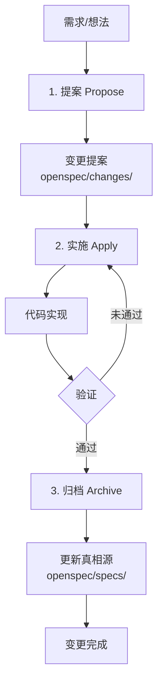
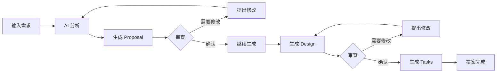
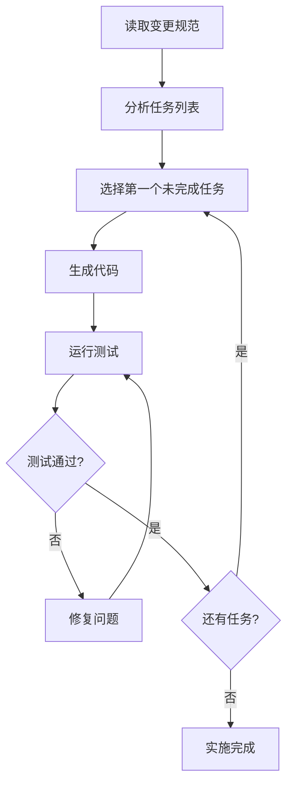
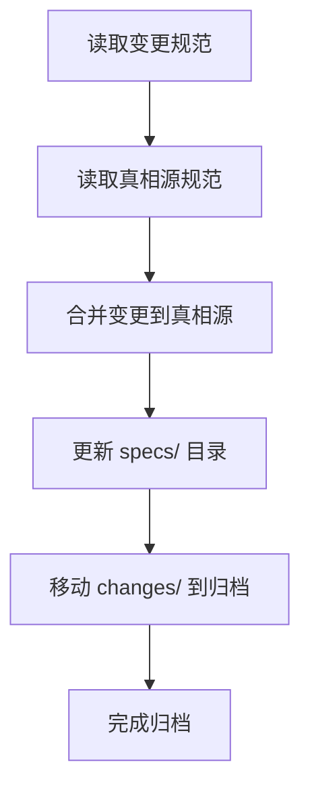

# OpenSpec 工作流程详解

> 工作流程概览
> OpenSpec 采用三步工作流：**提案（Propose）→ 实施（Apply）→ 归档（Archive）**。这个循环确保所有变更都有清晰的规范、可追溯的实现，并最终合并到系统的真相源中。

---

## 工作流程概览



### 三个阶段

| 阶段 | 命令 | 目的 | 产出物 |
|------|------|------|--------|
| **提案** | `/openspec-new-change` | 分析需求，创建规范 | `proposal.md` |
| **实施** | `/openspec-apply` | 基于规范编写代码 | 代码实现 |
| **归档** | `/openspec-archive` | 合并规范到真相源 | 更新的 `specs/` |

---

## 第一阶段：提案（Propose）

### 目标

将模糊的需求转化为明确的规范文档，让人类和 AI 就"要构建什么"达成一致。

### 触发方式

```bash
# 方式 1：交互式创建
/openspec-new-change

# 方式 2：直接描述需求
/openspec-new-change "添加用户 JWT 认证功能"

# 方式 3：快速模式（跳过交互）
/openspec-ff-change "实现订单支付流程"
```

### 生成的工件（Artifacts）

根据变更复杂度，OpenSpec 会生成以下一个或多个文档：

#### 1. Proposal（提案）

**文件名**：`proposal.md`

**内容**：
- **Why**：为什么要做这个变更
- **What**：变更的内容概述
- **Scope**：范围边界
- **Success Criteria**：成功标准

**示例**：
```markdown
# 提案：添加用户 JWT 认证

## Why
当前系统使用 session-based 认证，在分布式部署时存在状态同步问题。
需要迁移至无状态的 JWT 认证。

## What
实现基于 JWT 的用户认证系统，包括：
- 用户登录 API
- Token 生成与验证
- Token 刷新机制
- 登出功能

## Scope
- ✅ 用户认证相关 API
- ✅ Token 管理
- ❌ 权限系统（另提案处理）
- ❌ 第三方登录（另提案处理）

## Success Criteria
- [ ] 用户可以通过用户名密码登录
- [ ] 登录成功后返回有效的 JWT token
- [ ] Token 可以正确验证用户身份
- [ ] Token 过期后可以刷新
```

#### 2. Design（设计）

**文件名**：`design.md`

**内容**：
- **Architecture**：架构设计
- **Data Model**：数据模型
- **API Design**：接口设计
- **Error Handling**：错误处理

**示例**：
```markdown
# 设计：JWT 认证系统

## Architecture
```
Client → API Gateway → Auth Service → User DB
              ↓
         JWT Token
```

## Data Model

### User
```typescript
interface User {
  id: string;
  email: string;
  passwordHash: string;  // bcrypt
  createdAt: Date;
  updatedAt: Date;
}
```

### Token
```typescript
interface TokenPayload {
  userId: string;
  email: string;
  iat: number;
  exp: number;
}
```

## API Design

### POST /api/auth/login
**Request:**
```json
{
  "email": "user@example.com",
  "password": "string"
}
```

**Response (200):**
```json
{
  "accessToken": "eyJhbG...",
  "refreshToken": "eyJhbG...",
  "expiresIn": 3600
}
```

**Error Cases:**
- 400: 请求参数无效
- 401: 邮箱或密码错误
- 429: 登录尝试次数过多
```

#### 3. Tasks（任务）

**文件名**：`tasks.md`

**内容**：
- 具体的实现任务列表
- 每个任务的验收标准
- 任务依赖关系

**示例**：
```markdown
# 任务列表：JWT 认证

## Task 1: 安装依赖
- [ ] 安装 jsonwebtoken
- [ ] 安装 bcryptjs
- [ ] 更新 package.json

**验收标准：**
- `npm install` 成功
- 依赖正确添加到 package.json

## Task 2: 实现 Token 服务
- [ ] 创建 `src/services/token.service.ts`
- [ ] 实现 `generateToken()` 方法
- [ ] 实现 `verifyToken()` 方法
- [ ] 实现 `refreshToken()` 方法
- [ ] 编写单元测试

**验收标准：**
- 所有方法有完整的 JSDoc
- 单元测试覆盖率 > 80%
- 测试全部通过

## Task 3: 实现登录 API
- [ ] 创建 `src/routes/auth.routes.ts`
- [ ] 实现 POST /login 路由
- [ ] 添加请求验证
- [ ] 集成 Token 服务
- [ ] 添加错误处理

**验收标准：**
- API 可以通过 curl/Postman 调用
- 正确的请求返回 200 + token
- 错误的请求返回适当的错误码
```

### 提案阶段的工作流程



### 提案目录结构

```
openspec/changes/
└── change-001-add-jwt-auth/
    ├── proposal.md      # 提案文档
    ├── design.md        # 设计文档（可选）
    └── tasks.md         # 任务列表（可选）
```

---

## 第二阶段：实施（Apply）

### 目标

基于已确认的规范编写代码，将设计转化为实际实现。

### 触发方式

```bash
# 实施当前变更
/openspec-apply

# 或指定变更
/openspec-apply change-001
```

### 实施过程



### AI 实施策略

#### 1. 基于规范生成代码

AI 会：
- 读取 `design.md` 中的架构和数据模型
- 参考 `tasks.md` 中的任务描述
- 遵循项目现有的代码风格
- 生成符合规范的实现

#### 2. 增量式开发

```
任务 1: 安装依赖
  ↓ 完成
任务 2: 实现 Token 服务
  ↓ 完成
任务 3: 实现登录 API
  ↓ 完成
任务 4: 添加测试
  ↓ 完成
实施完成
```

#### 3. 验证与反馈

每个任务完成后：
- 运行测试验证功能
- 检查是否符合规范
- 如有问题，自动修复或反馈给用户

### 实施示例

```markdown
# 用户：实施 JWT 认证变更

> /openspec-apply

AI: 正在读取变更规范...
    发现 4 个任务
    开始实施 Task 1: 安装依赖

    ✓ 安装 jsonwebtoken
    ✓ 安装 bcryptjs
    ✓ 安装 @types/jsonwebtoken

AI: Task 1 完成
    开始 Task 2: 实现 Token 服务

    ✓ 创建 src/services/token.service.ts
    ✓ 实现 generateToken() - 使用 RS256 算法
    ✓ 实现 verifyToken() - 包含过期检查
    ✓ 实现 refreshToken() - 刷新令牌轮换
    ✓ 创建 src/services/__tests__/token.service.test.ts
    ✓ 运行测试 - 5 个测试全部通过

AI: Task 2 完成
    ...继续 Task 3、Task 4...

AI: 所有任务完成！
    已生成代码：
    - src/services/token.service.ts
    - src/routes/auth.routes.ts
    - src/middleware/auth.middleware.ts
    - 对应的测试文件

    建议运行：npm test 验证所有测试
```

---

## 第三阶段：归档（Archive）

### 目标

将完成的变更规范合并到系统的真相源中，更新主规范文档。

### 触发方式

```bash
# 归档当前变更
/openspec-archive

# 批量归档多个变更
/openspec-bulk-archive change-001 change-002
```

### 归档过程



### 合并策略

#### 1. Delta 合并

将变更规范中的 `ADDED`、`MODIFIED`、`REMOVED` 标记应用到真相源：

```markdown
# 变更规范（change-001/proposal.md）
## 认证模块

### ADDED
- JWT token 支持

### MODIFIED
- 登录接口返回格式

# 真相源（specs/auth.spec.md）
## 认证模块
- 支持用户名密码登录
- 使用 session-based 认证

# 合并后（更新后的 specs/auth.spec.md）
## 认证模块
- 支持用户名密码登录
- 使用 JWT token 认证  ← 已更新
- 支持 token 刷新      ← 新增
```

#### 2. 文件组织

归档后的真相源结构：

```
openspec/
├── specs/
│   ├── main.spec.md        # 主规范索引
│   ├── auth.spec.md        # 认证模块规范
│   ├── user.spec.md        # 用户模块规范
│   └── api.spec.md         # API 规范汇总
└── changes/
    └── _archived/          # 已归档的变更
        └── change-001-add-jwt-auth/
            └── ...
```

### 归档完成后的工作

1. **真相源更新**：主规范文档反映最新系统状态
2. **变更历史保留**：归档的变更保留完整历史
3. **代码与规范一致**：实施代码与规范匹配
4. **可追溯性**：可以通过变更历史追溯决策

---

## 扩展工作流程

### 探索模式（Explore）

在实际提案之前，先研究问题和澄清需求：

```bash
/openspec-explore
```

使用场景：
- 不确定如何解决问题
- 需要调研技术方案
- 澄清模糊的需求

**示例**：
```markdown
用户：/openspec-explore

AI: 探索模式已激活。我可以帮你：
    1. 调研技术方案
    2. 分析问题原因
    3. 澄清需求范围
    4. 评估可行性

用户：我想优化数据库查询性能，但不确定从哪里入手

AI: 让我先分析一下当前的数据库使用情况...
    [分析数据库查询日志]
    [识别慢查询]
    [评估索引使用情况]

    发现以下优化机会：
    1. users 表缺少 email 字段索引
    2. orders 表查询没有使用覆盖索引
    3. 存在 N+1 查询问题

    建议创建变更提案来处理这些发现。
    是否需要我创建 "数据库性能优化" 的提案？
```

### 验证模式（Verify）

在归档前验证实现是否符合规范：

```bash
/openspec-verify
```

验证内容：
- 实现是否符合设计文档
- 代码是否完整
- 测试是否通过
- 是否满足成功标准

### 同步规范（Sync）

将变更规范同步到主规范（不归档）：

```bash
/openspec-sync-specs
```

适用场景：
- 需要保持变更活跃
- 同时更新主规范

---

## 工作流程变体

### 快速模式（Fast-forward）

跳过逐步确认，一次性生成所有工件：

```bash
/openspec-ff-change "实现订单支付功能"
```

生成：
- proposal.md
- design.md
- tasks.md

适合：
- 紧急变更
- 简单功能
- 已充分理解的需求

### 迭代模式

分步生成工件，每步确认后继续：

```bash
# 步骤 1: 创建提案
/openspec-new-change
# 审查并确认 proposal.md

# 步骤 2: 继续到设计
/openspec-continue-change
# 审查并确认 design.md

# 步骤 3: 生成任务
/openspec-continue-change
# 审查 tasks.md

# 步骤 4: 实施
/openspec-apply
```

适合：
- 复杂功能
- 需要仔细审查
- 团队协作

---

## 工作流程最佳实践

### 1. 变更粒度

**推荐**：
- 一个变更聚焦一个功能点
- 变更范围在 1-3 天内可完成
- 变更之间保持独立

**示例**：
```
✅ 好的变更粒度：
- change-001: 添加 JWT 登录
- change-002: 添加 Token 刷新
- change-003: 添加登出功能

❌ 不好的变更粒度：
- change-001: 实现完整的认证系统（太大）
- change-002: 修复一个拼写错误（太小）
```

### 2. 并行变更管理

```
openspec/changes/
├── change-001-jwt-login/      # 进行中
├── change-002-user-profile/   # 进行中
└── change-003-db-optimization/ # 待开始

可以同时实施多个变更
但归档时需要按依赖顺序
```

### 3. 依赖处理

如果变更 B 依赖变更 A：

```bash
# 1. 先归档变更 A
/openspec-archive change-001

# 2. 然后实施变更 B
/openspec-apply change-002

# 3. 最后归档变更 B
/openspec-archive change-002
```

---

## 相关文档

- OpenSpec 概述与核心概念 - 基础概念介绍
- OpenSpec 实践指南 - 实际操作示例
- OpenSpec 进阶与最佳实践 - 高级用法

---

*文档版本: 1.0*
*最后更新: 2025-02-10*