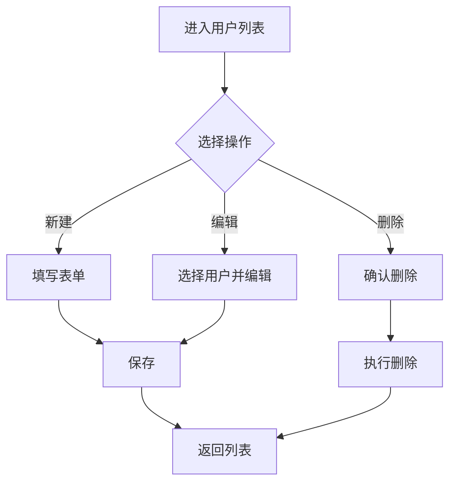
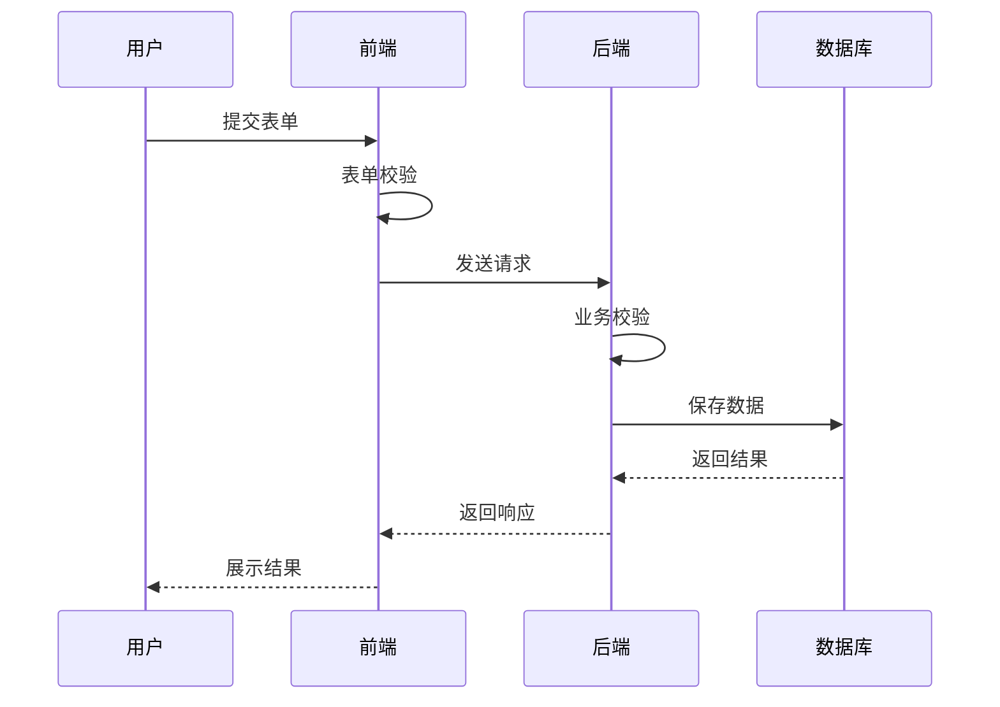
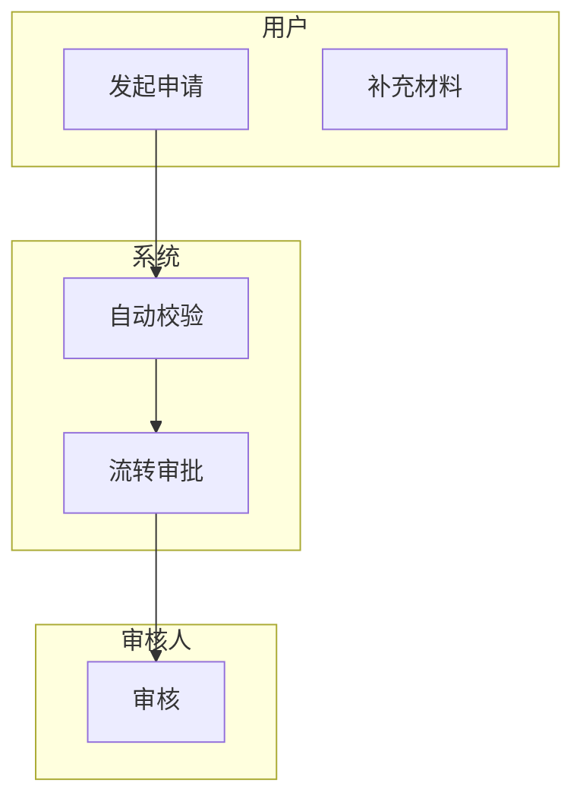
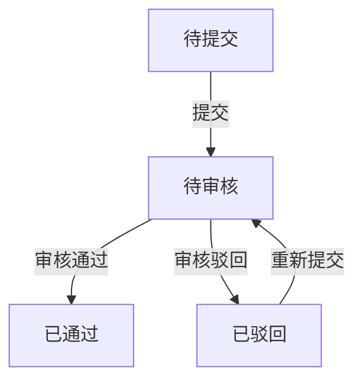
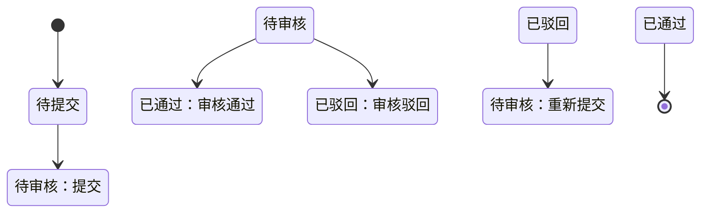
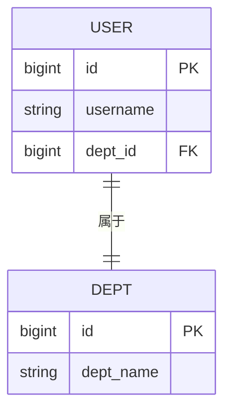
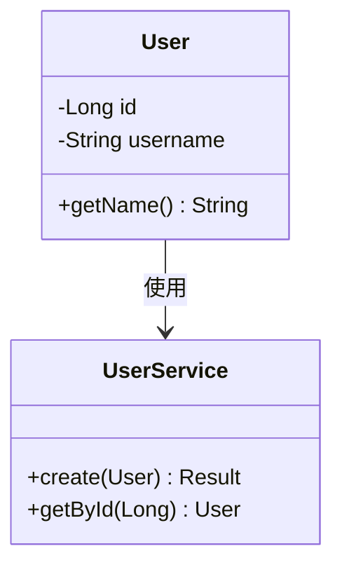

# 系统分析中的流程图设计

> 在系统分析文档中，使用流程图从不同视角描述系统行为

---

## 三种核心流程图

### 1. 业务流程图（用户操作视角）

描述用户如何操作系统，完成业务目标

**适用场景**：
- 描述用户操作流程
- 培训文档
- 用户手册

**示例**：

### 2. 数据流程图（系统处理视角）

描述数据在系统中的流转和处理过程

**适用场景**：
- 描述系统内部处理逻辑
- 数据流转分析
- 接口设计参考

**示例**：

### 3. 时序图（交互视角）

描述对象/组件之间的交互时序

**适用场景**：
- 接口交互设计
- 前后端协作
- 复杂流程的时序分析

**示例**：

---

## 绘制技巧

### 先主后次

1. 先画主流程（Happy Path）
2. 再画分支流程
3. 最后画异常流程

### 角色区分

用不同颜色或泳道区分不同角色/系统：

### 状态标注

在流程中标注状态变化：

---

## 状态流转图

用于描述对象状态的变化：

---

## ER 图（实体关系图）

用于描述数据模型：

---

## 类图（对象模型）

用于描述代码结构：

---

## 工具推荐

- **Mermaid**：文本绘图，集成在 Markdown 中
- **Draw.io**：图形化绘图，支持导出多种格式
- **PlantUML**：专业的 UML 绘图工具

---

## 相关工作

- PRD 系统分析 - 系统分析文档的完整内容
- PRD 分析方法论 - 完整的 PRD 分析流程
- [Mermaid 语法教程](https://mermaid.js.org/intro/)

---

## 模板位置

- `99_系统/模板/PRD 分析/` 中的各模板都包含流程图示例